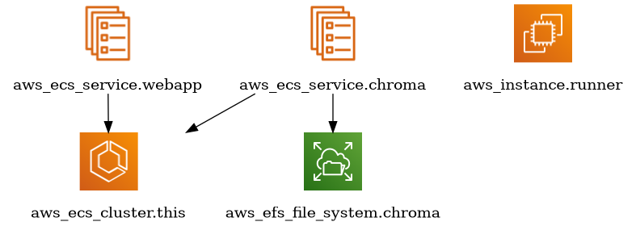

# cvbot-infra
Terraform project for the CVBot RAG infrastructure

## Architecture



### Web application

The `cvbot-retriever` web application runs as a second Fargate service in the
existing ECS cluster.

```
Internet -- HTTPS --> API Gateway HTTP API ($default stage)
                        |
                        +-- VPC link --> Cloud Map "webapp" (SRV)
                                            |
                                            +-- webapp task --> chroma task
```

- **Public access** goes through an API Gateway HTTP API, which provides HTTPS
  on its default `execute-api` domain without owning a domain or managing
  certificates. Unlike a load balancer it has no hourly charge, so scaling the
  service to `desired_count = 0` leaves no idle cost.
- **Service discovery** via the Cloud Map namespace `cvbot.internal` gives both
  services stable DNS names despite changing Fargate task IPs. The web app
  registers an SRV record because API Gateway needs the port; ChromaDB
  registers an A record and is reached at `chroma.cvbot.internal`.
- **ChromaDB stays private.** Its security group has no public ingress rule;
  only the runner and the web application security groups may reach
  `chroma_port`. The web app itself only accepts traffic from the VPC link.
- **Scaling** follows the ChromaDB pattern: `desired_count` toggles between 0
  and 1 from the workflows, and Terraform ignores it. The service runs exactly
  one task, which is what the in-memory conversation store requires.
- **Images** are pushed to the `cvbot-webapp` ECR repository by the deploy
  workflow, which assumes the existing `gha_deploy` OIDC role.
